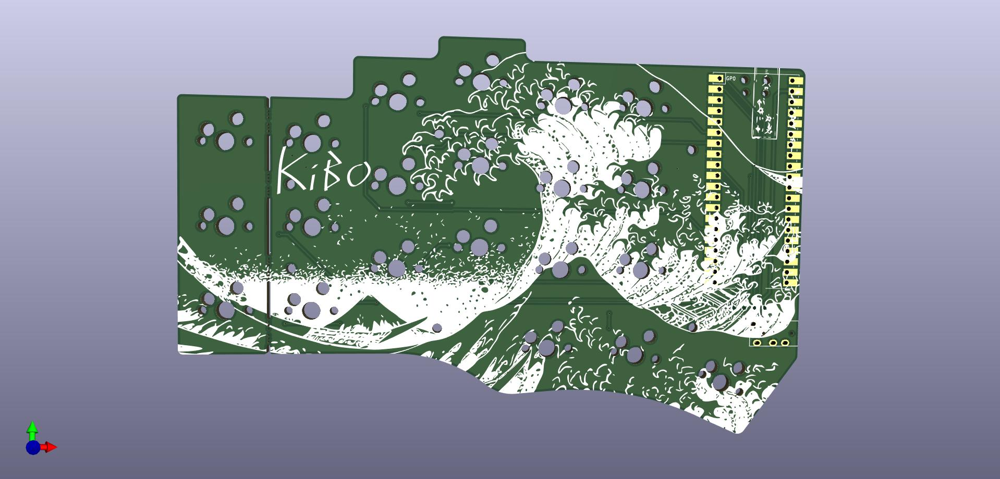

# The KiBo splitboard

An awesome custom split keyboard, at least I think so 😉. Made by Max Kivits and
Timon Borg, the KiBo!

This keyboard is loosely based on the [Piantor] and [Cantor] keyboards. It's a
42-key diodeless non-flippable cherry-mx hotswapable mechanical split keyboard
with aggressive column staggering. It's powered by 2 RP2040, completely overkill!
I redesigned the PCB to use cherry-mx style hotswap switches and adjusted the
margins so it fits my hands better.
The pcb features an artsy silklayer, because why not?

The casing is designed by Timon Borg, a god amongst fusion360 users!

KiBo uses the amazing [qmk] firmware to become a keyboard.

## Features

* RP2040 MCU - A low-cost, easy-to-source, powerful microcontroller with dual Arm Cortex-M0+ @ 133MHz, 264kB on-chip SRAM and 2MB (up to 16MB, depending on the breakout board) off-chip external flash memory. You can enable a lot of features and layers. Never worry about the firmware size limit.
* Cantor layout - Ergonomic strong column staggering for short pinkies.
* Non-flippable PCBs - Fewer ways to make mistakes when you install the controller breakout boards. Great for first time keyboard builders.
* Diodeless - A more robust build with fewer things to solder or break.
* Hybrid hotswap and soldered-in low profile choc switches - Experiment with different key switches with the hotswap sockets, or solder the key switches for a more stable build.
* Breakable pinky column - Easily convert the PCB from a 42-key to 36-key layout. You can snap off the pinky column without specialized tools.

## Bill of Materials (BOM)

Quantity | Item | Notes
--- | --- | ---
1 | KiBo PCB (Left)
1 | KiBo PCB (Right)
2 | RP2040 breakout boards (such as Raspberry Pi Pico or WeAct RP2040)
42 (or 36) | cherry-mx style switches of your favorite flavor
42 (or 36) | cherry-mx style keycaps of your favorite variety
2 | TRRS jack (PJ-320A)
1 | 3.5mm TRRS cable | TRS cable cannot be used
42 (or 36) | cherry-mx style hotswap sockets | Optional, you can solder the switches directly if you do not use hotswap sockets
4 | Pin headers (20p) or sockets  | Only required for boards without castellated holes
2 | 10kΩ 1206 (3216M) SMD resistor | Only required if you do not want to use SPLIT_USB DETECT, and for boards without a built in VBUS_SENSE circuit
2 | 5.6kΩ 1206 (3216M) SMD resistor | Only required if you do not want to use SPLIT_USB DETECT, and for boards without a built in VBUS_SENSE circuit
1 | KiBo Case (Left) | 3D print your own
1 | KiBo Case (Right)| 3D print your own

* Note: Raspberry Pi Pico comes with castellated holes and a built in VBUS_SENSE circuit

[Piantor]: https://github.com/beekeeb/piantor
[Cantor]: https://github.com/diepala/cantor
[qmk]: https://github.com/qmk/qmk_firmware
